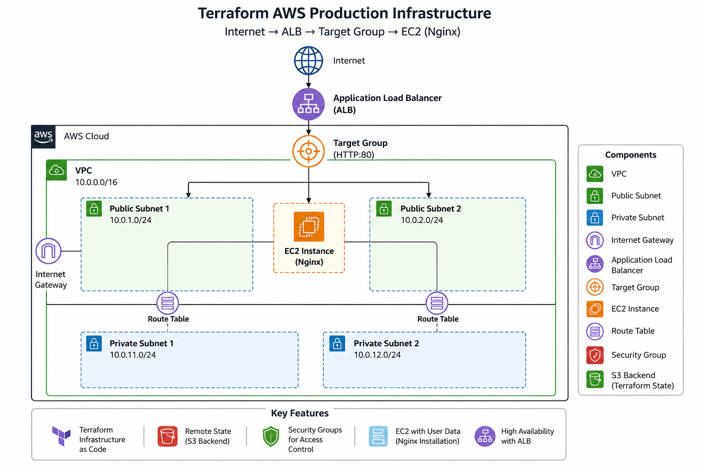

# Terraform AWS Production Infrastructure

## Overview

This project provisions a production-style AWS infrastructure using Terraform with a modular architecture. The infrastructure includes networking, security, compute resources, and load balancing components.

## Architecture



Internet → Application Load Balancer → Target Group → EC2 Instance (Nginx)

### Components

* VPC
* Public Subnets (2)
* Private Subnets (2)
* Internet Gateway
* Route Tables
* Security Groups
* EC2 Instance
* Application Load Balancer (ALB)
* Target Group
* Listener
* Remote Terraform State (S3 Backend)

## Project Structure

```text
terraform-aws-production-infra/
├── main.tf
├── variables.tf
├── outputs.tf
├── backend.tf
├── modules/
│   ├── vpc/
│   ├── security-group/
│   ├── ec2/
│   └── alb/
```

## Features

* Modular Terraform design
* Remote state management using S3
* Automated EC2 provisioning
* Nginx installation through User Data
* Application Load Balancer integration
* Security Group based access control

## Prerequisites

* AWS Account
* Terraform
* AWS CLI
* Git

## Deployment

Initialize Terraform:

```bash
terraform init
```

Validate configuration:

```bash
terraform validate
```

Review execution plan:

```bash
terraform plan
```

Deploy infrastructure:

```bash
terraform apply
```

Destroy infrastructure:

```bash
terraform destroy
```

## Future Enhancements

* Auto Scaling Group (ASG)
* Launch Template
* GitHub Actions CI/CD
* Route53
* HTTPS using ACM
* Multi-environment deployment (Dev/Stage/Prod)

## Skills Demonstrated

* AWS Networking
* Infrastructure as Code (Terraform)
* Load Balancing
* Security Groups
* EC2 Provisioning
* Remote State Management
* Git & GitHub
* Linux Administration

