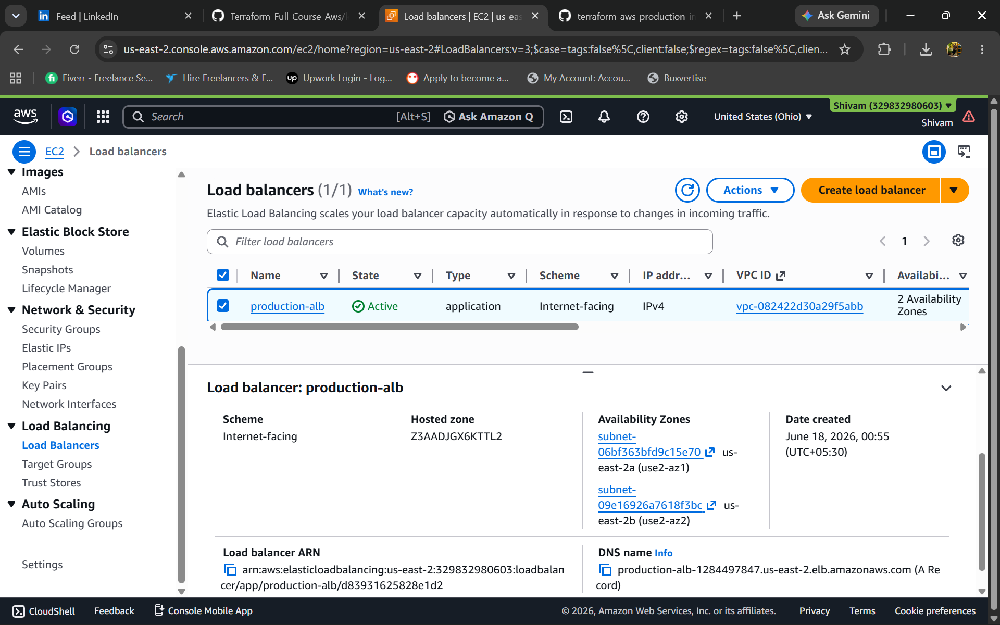
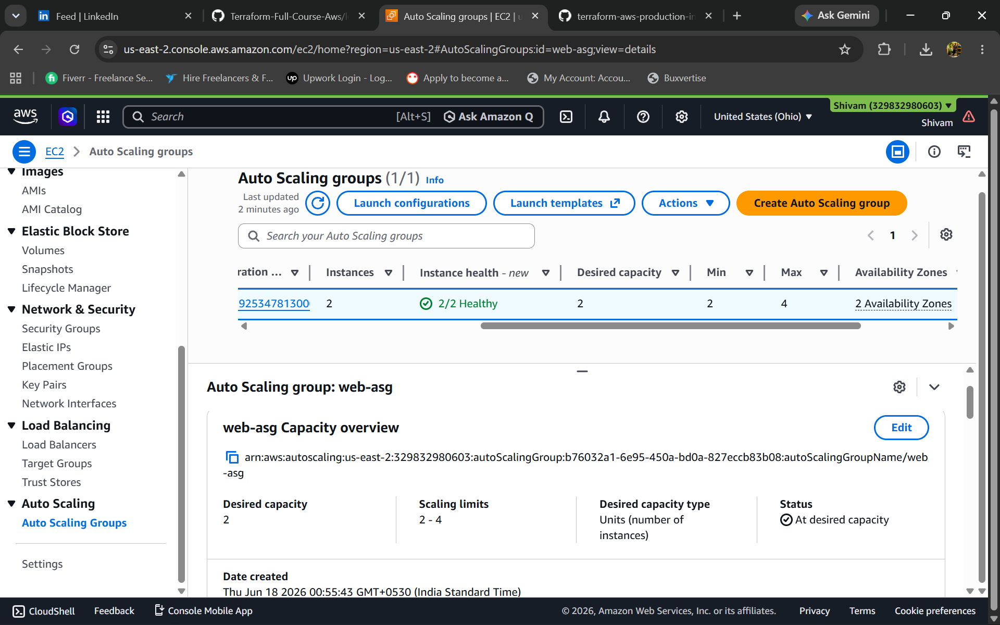
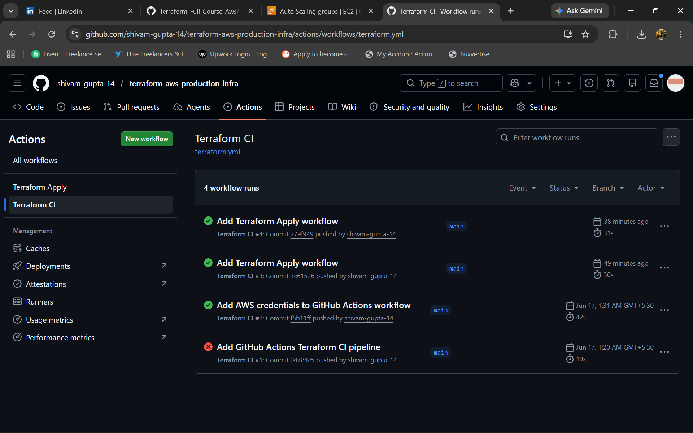
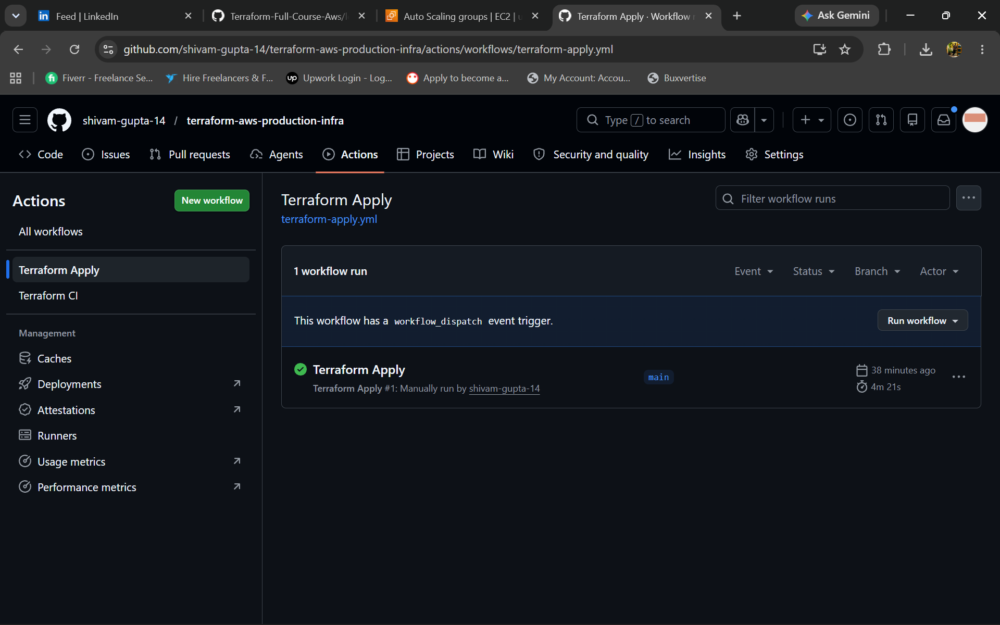

# Terraform AWS Production Infrastructure

## Overview

This project provisions a production-style AWS infrastructure using Terraform with a modular architecture. The infrastructure includes networking, security, compute resources and load balancing components.

## Architecture


### Components

* VPC
* Public Subnets (2)
* Private Subnets (2)
* Internet Gateway
* Route Tables
* Security Groups
* EC2 Instance
* Application Load Balancer (ALB)
* Target Group
* Listener
* Remote Terraform State (S3 Backend)
* Launch Template
* Auto Scaling Group (ASG)
* GitHub Actions CI Pipeline
* GitHub Actions CD Pipeline

## Project Structure

```text
modules/
├── vpc/
├── security-group/
├── alb/
└── asg/

.github/
└── workflows/
    ├── terraform.yml
    └── terraform-apply.yml
```

## Features

- Modular Terraform Architecture
- Remote State Management using Amazon S3
- Multi-AZ VPC Design
- Public and Private Subnets
- Internet Gateway and Route Tables
- Security Groups
- Application Load Balancer (ALB)
- Launch Templates
- Auto Scaling Group (ASG)
- GitHub Actions CI Pipeline
- GitHub Actions CD Pipeline with Manual Approval
- Automated Nginx Provisioning using User Data

## Prerequisites

* AWS Account
* Terraform
* AWS CLI
* Git

## Deployment

Initialize Terraform:

```bash
terraform init
```

Validate configuration:

```bash
terraform validate
```

Review execution plan:

```bash
terraform plan
```

Deploy infrastructure:

```bash
terraform apply
```

Destroy infrastructure:

```bash
terraform destroy
```

## CI/CD Workflow

Developer Push
      |
GitHub Actions
      |
Terraform fmt
      |
Terraform validate
      |
Terraform plan
      |
Manual Approval
      |
Terraform apply


## Future Enhancements

- Route53 Integration
- HTTPS using ACM Certificate
- CloudWatch Monitoring
- OIDC Authentication for GitHub Actions
- Multi-Environment Deployment (Dev/Stage/Prod)


## Skills Demonstrated

- AWS Networking
- Infrastructure as Code (Terraform)
- Load Balancing
- Auto Scaling
- GitHub Actions
- CI/CD Automation
- Security Groups
- Remote State Management
- Git & GitHub
- Linux Administration

## Screenshots

### Application Load Balancer



### Auto Scaling Group



### GitHub Actions CI Pipeline



### Terraform Apply Approval Workflow


